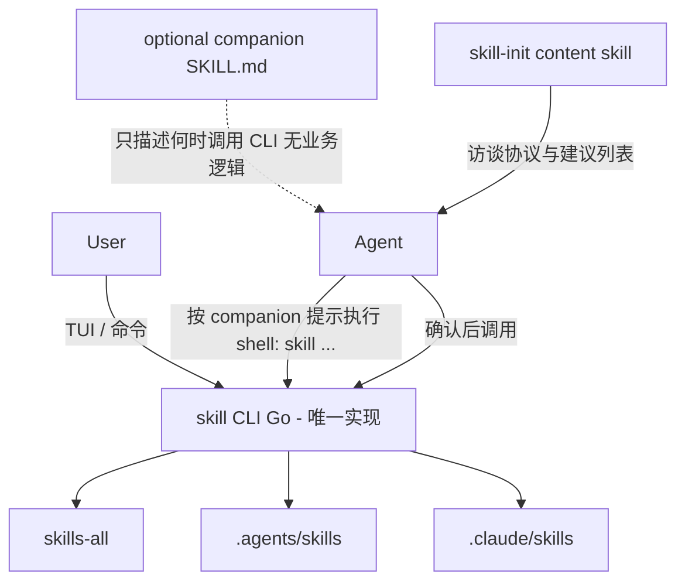

# Skill Manager：修订设计（含多路径 / 语言 / Skill vs CLI）

## 结论（不变）

痛点成立：活动 skill 过多 → token 税 + 注意力稀释。正确抽象仍是 **全量仓库 + 精简活动集 + 命名 profile**。

针对你补充的三点，拍板如下：

1. **多路径**：真源只在 `skills-all`；`.agents/skills` 与 `.claude/skills` 都是活动集，**各自直连** `skills-all`（禁止 `.claude → .agents → all` 二层链）；启停必须双侧原子同步。
2. **语言**：**Go**（bubbletea TUI），产出单二进制，不用 shell 脚本做核心逻辑。
3. **形态**：**CLI 是主产品**；可选附带极薄 companion skill（只教 Agent 何时跑 `skill …`）。**不做**「skill 包一层终端」或「终端再包一层 skill 逻辑」的互相包含。

---

## 1. 多路径与 Claude Code 特例

### 现状（已核实）

[`~/.claude/skills`](/home/no_story/.claude/skills) 已是混杂态：

- 部分 **symlink** → `~/.agents/skills/<name>`（如 `browser-use`、`dev-deploy`、`find-skills`）——这就是二层链的前半段
- 大量 **实体目录**（cloudflare 系、`diagnose`、`tdd` 等）——与 `.agents` 重复或仅 Claude 侧有
- Claude Code **不扫描** `~/.agents/skills`，要对 Claude 生效必须在 `~/.claude/skills` 可见

[`~/.agents/skills`](/home/no_story/.agents/skills) 目前多为实体目录（约 24 个）。

### 目标布局（禁止二层软链）

```text
~/.agents/
  skills-all/<name>/     # 唯一真源（实体）
  skills/<name> -> ../skills-all/<name>          # Cursor / 通用 agents 活动集
  profiles/{default,codex,core,...}

~/.claude/
  skills/<name> -> ../../.agents/skills-all/<name>   # Claude Code 活动集（直连真源）
```

启用 / 禁用规则：

| 操作 | `.agents/skills` | `.claude/skills` | `skills-all` |
|------|------------------|------------------|--------------|
| enable | 建 symlink | 建 symlink | 不动 |
| disable | 删 symlink | 删 symlink | 保留 |
| remove（二期） | 删 symlink | 删 symlink | 删实体 |

**不采用** `.claude/skills/foo → .agents/skills/foo → skills-all/foo`：中间一环断了 Claude 侧全挂，且 disable 只清一侧会留幽灵。

### `sync` 摄入源（统一落点）

外部安装落点不统一，sync 扫描并迁移：

1. `~/.agents/skills/*`（实体目录 → move 进 `skills-all`；已是指向 all 的合法链 → 保留；指向别处的旧链 → 解析后规范化）
2. `~/.claude/skills/*`（同上；若与 all 中同名冲突，按 mtime/内容哈希去重，默认保留较新，冲突时打印告警）
3. 应用当前 profile，**重建双侧**活动集 symlink

`npx skills add` 等仍可能写进 `.agents/skills`：不必首期劫持安装器，约定「装完跑一次 `skill sync`」或日后加 watch/hook。

### 移除机制（与建立对称）

- `disable` / `use` 换 profile：只动 symlink，且 **两侧一起改**（先写临时清单，再 apply，失败可回滚到上一 profile 快照）
- 清理 bootstrap：拆除所有 `.claude → .agents/skills` 旧链，改为直连 `skills-all`；重复实体只留一份在 all

可选配置（默认开启 Claude 镜像）：

```text
targets:
  - ~/.agents/skills
  - ~/.claude/skills    # 可关：仅管 agents
```

---

## 2. 实现语言：Go（已定）

| 选项 | 为何不选 / 为何选 |
|------|-------------------|
| Shell | 你已踩过：易卡壳、引号/路径坑、跨 OS 差 —— **排除出核心** |
| Python + uv | 迭代快，但分发依赖解释器；TUI 也可，作备选 |
| Node | 生态有 `npx skills`，但再挂一个 runtime 偏重 |
| Rust | 能做，对本工具过重 |
| **Go 1.23**（本机已有） | **选定**：单文件二进制、跨编 Windows/macOS/Linux、symlink API 清晰、bubbletea/lipgloss 做 TUI 成熟 |

交付：`go install` / 发布 binary，入口命令 `skill`。核心逻辑全在 Go；最多留一层极薄的 shell wrapper 仅用于 PATH 安装（可选，非业务）。

Windows 注意：原生 Windows 创建 symlink 需 Developer Mode 或提权；你主环境是 WSL2，首期以 **Linux/macOS/WSL** 为准，Windows 原生标为二期或文档说明。

---

## 3. CLI vs Skill：CLI 为主，Skill 极薄且不互包

### 为什么不能「整个功能只做成 skill」

- TUI（空格多选）无法靠 SKILL.md 实现，必须有进程
- Agent 用自然语言改目录不可靠（漏删一侧、弄成二层链、误删真源）
- `skill-manager` 若本身要靠「已被启用」才能用，会和「清空活动集 / init」打架

### 为什么不要「两者互相包含」

```text
反例：Skill 文档里重写一遍启停步骤
      CLI 再去读某 skill 目录当配置
→ 两套真相，复杂度叠乘
```

### 推荐关系（单向）



| 部件 | 职责 |
|------|------|
| **Go CLI** | sync / enable / disable / use / save / TUI / init（切 core profile）——全部文件系统真相 |
| **companion skill**（可选，进 core） | 短文：用户要管 skill / 抱怨 token 太多时，执行哪些 `skill` 命令；**不写**复制/软链步骤 |
| **skill-init skill**（content） | 只负责「问项目、给建议清单」；真正启用仍调 `skill enable` / `skill use` |

用户日常可以 **只装 CLI、不启用任何 manager skill**，完全不增加 token。Agent 协助装配时再启用 companion + skill-init。

---

## 命令面（首期，不变骨架 + 多路径语义）

| 命令 | 行为 |
|------|------|
| `skill` | TUI：列出 `skills-all`，勾选启用，回车后双侧 apply |
| `skill list` | 全部 / 已启用（可标 Claude 侧是否一致） |
| `skill enable\|disable <name...>` | 双侧启停 |
| `skill use <profile>` | 按清单重建双侧活动集 |
| `skill save <profile>` | 按当前 `.agents/skills` 启用集保存（以 agents 侧为准，apply 时对齐 Claude） |
| `skill sync` | 双路径摄入 → all → 规范化链接 |
| `skill doctor` | 检测二层链、只存在一侧、实体漏迁、双侧不一致 |
| `skill init` | 切到 `core` profile（含 companion + skill-init，仍双侧） |

二期：`add/remove`（可包装 `npx skills`）、项目级 profile、原生 Windows。

---

## 真源与 profile（保留前版）

```text
skills-all/           # 唯一实体仓库
profiles/
  default.txt
  codex.txt           # 替代整目录 skills-codex 覆盖
  core.txt            # companion + skill-init（+ 可选 find-skills）
```

`skill use codex` = 换清单，不是拷贝 `skills-codex/` 覆盖。空的 `skills-codex` / `skills-disabled` 可废弃或仅作导入一次性来源。

---

## 安全与 bootstrap

1. `skill doctor` → 报告混杂态  
2. `skill sync`：实体迁入 `skills-all`，去重；旧 `.claude → .agents/skills` 链改为直连 all  
3. 生成 `profiles/default` = 迁移前 `.agents/skills` 中的名字集合  
4. 切换 profile 前若发现活动集内「未入仓实体」，拒绝并提示先 sync  

---

## 落地顺序（修订）

1. Go 模块骨架 + 路径配置（agents home、claude skills、targets）  
2. `sync` + `doctor`（双路径摄入、去二层链）  
3. `enable` / `disable` / `list` / `use` / `save`（双侧原子 apply）  
4. bubbletea TUI  
5. `init` + `profiles/core` + 薄 companion / skill-init 文案  
6. 对本机执行一次 bootstrap，验证 Cursor 与 Claude Code 看到的活动集一致且可削减  

---

## 明确不做

- 用 shell 实现启停/同步核心  
- 二层软链（`.claude → .agents/skills → all`）  
- 为每个 Agent 维护平行实体树或整目录覆盖  
- Skill 内重复实现 CLI 逻辑，或 CLI 依赖某 skill 目录才能工作  
- 首期抢 `npx skills` / `.skill-lock.json` 的安装权威  
